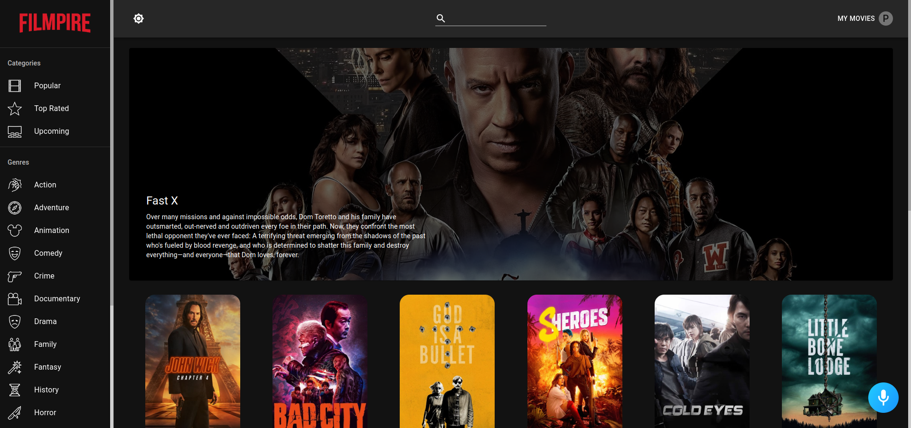
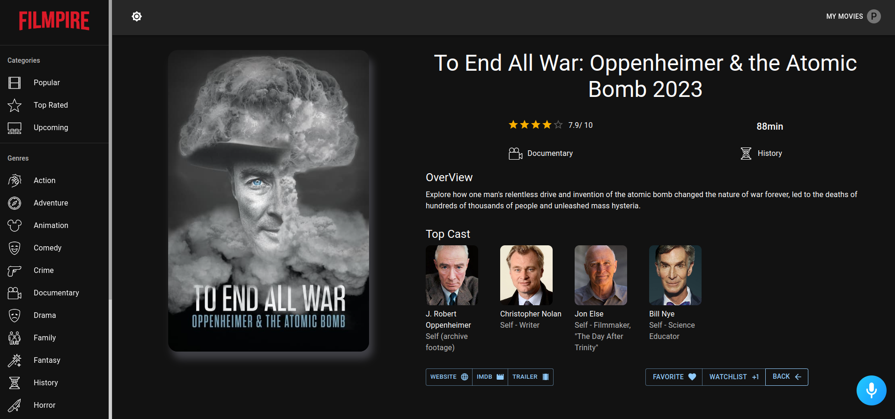

# Filmpirex

[Live Site](https://filmpirex24.netlify.app/)

## About Filmpirex

Features include:

-   User Authentication,
-   Light and Dark mode,
-   API calls with Axios and Redux,
-   Actors and Movie Details Page,
-   Watchlist and List of Favorite Movies,
-   Movie Search Functionality,
-   Alan AI Voice Functionality and many more.

Alan works as an in-app voice assistant for the Filmpirex project.

## Getting Started

To get a local copy up and running follow these simple steps.

### Prerequisites

List of things you need to use and how to install them:

-   npm
    ```sh
    npm install npm@latest -g
    ```

### Installation

Setup:

1. Get a free TMDB API Key at [https://www.themoviedb.org/](https://www.themoviedb.org/).
2. Clone the repo:
    ```sh
    git clone https://github.com/bydonjr/filmpirex.git
    ```
3. Install NPM packages:

    ```sh
    npm install --legacy-peer-deps
    ```
4. Create your `.env` file as it is instructed in `.env.example`.
5. Enter your TMDB API key in your `.env`.

### Screenshots



